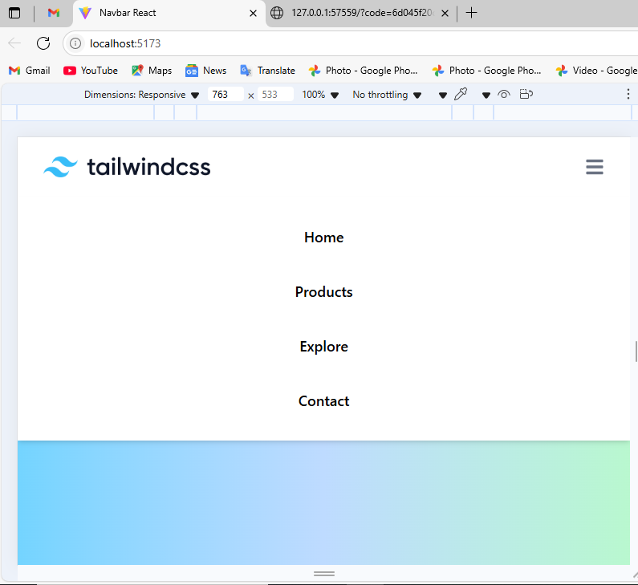

# 🌐 Tailwind CSS Responsive Navbar

A modern and fully responsive **navigation bar** built with **ReactJS** and **Tailwind CSS**. This project features a gradient background, a mobile-friendly hamburger menu, and a clean UI design — ideal for websites, landing pages, and React-based applications.

---

## 📸 Demo Preview

Here’s a quick look at the responsive Tailwind CSS Navbar:

<p align="center">
  
</p>

---

## 🚀 Features

- 🔥 Fully responsive navigation bar
- 🌈 Tailwind CSS gradient background
- 📱 Mobile-friendly hamburger toggle
- ⚛️ Built using **ReactJS + Vite**
- 🎨 Sleek and minimal UI design
- 💡 Easy to customize and reuse

---

## 🛠️ Technologies Used

- [ReactJS](https://reactjs.org/)
- [Tailwind CSS](https://tailwindcss.com/)
- [Vite](https://vitejs.dev/)
- [React Icons](https://react-icons.github.io/react-icons/)

---

## 📦 Installation & Local Setup

Follow these steps to run the project locally:

```bash
# 1. Clone the repository
git clone https://github.com/Alinaimdad/Tailwindcss_navbar.git

# 2. Navigate to the project folder
cd Tailwindcss_navbar

# 3. Install the dependencies
npm install

# 4. Start the development server
npm run dev

